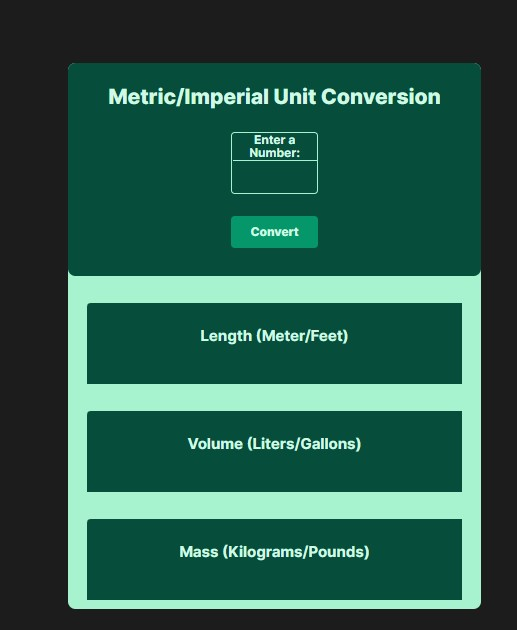
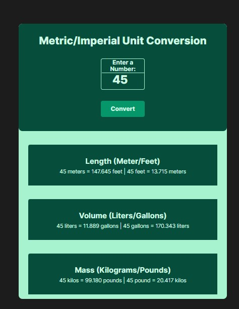

Readme

This is a simple unit conversion calculator built with JavaScript that converts length, volume, and mass units. The conversion factors used in this calculator are as follows:

    1 meter = 3.281 feet
    1 liter = 0.264 gallon
    1 kilogram = 2.204 pound

How to Use

To use the calculator, enter a numeric value in the input field and click the "Convert" button. The calculator will then display the converted values for length (meters/feet), volume (liters/gallons), and mass (kilograms/pounds).

Error Handling

The calculator performs error handling by checking if the input value is a positive number. If the input value is not a positive number, the calculator will display an alert message asking the user to enter a positive number.

Code Explanation

The calculator consists of two main elements: the HTML code that defines the input field and the output elements, and the JavaScript code that performs the unit conversions and updates the output elements.

The JavaScript code defines six functions, two for each type of unit conversion (length, volume, and mass). These functions take a numeric value as input and return the converted value.

The code then defines event listener for the "Convert" button. When the button is clicked, the code retrieves the input value, performs error handling, and then calls the six conversion functions to convert the input value to its equivalent values in other units. The converted values are then displayed in the output elements using HTML string templates.

[See live version](https://mcoverter.netlify.app/)

Installation

To use this calculator on your own website, simply copy and paste the HTML and JavaScript code into your web page. You can customize the appearance of the calculator by modifying the CSS styles.